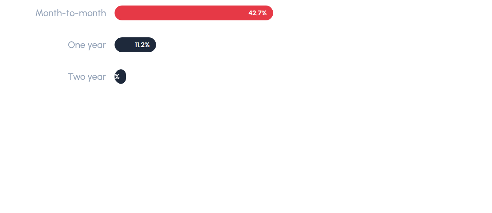
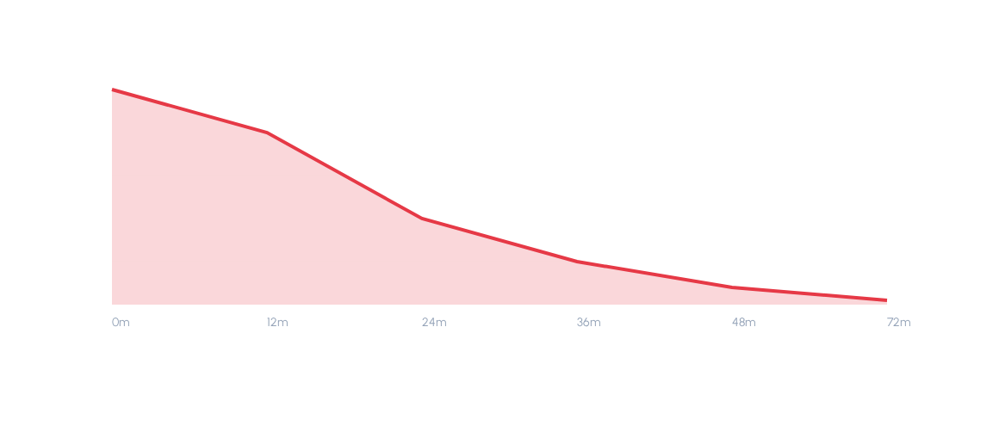
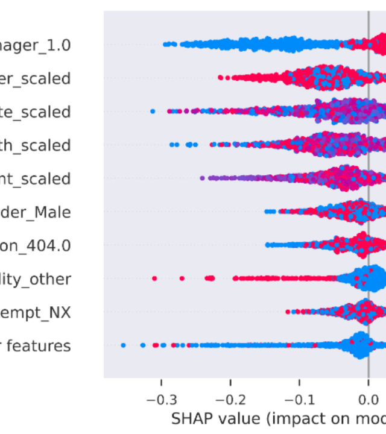
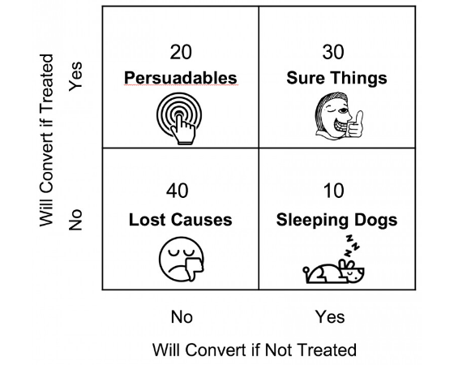

# 🔍 Churn Detective — Telecom Customer Retention & Uplift Strategy

An end-to-end Machine Learning pipeline designed to address telecom customer churn by detecting high-risk customers, identifying key churn drivers, segmenting at-risk behaviors, and optimizing retention campaign ROI using causal uplift modeling.

---

## 📊 Executive Summary

* **Best Model**: `XGBoost (Tuned)`
* **ROC-AUC**: `0.7324` | **PR-AUC**: `0.5874` | **F1 Score**: `0.5886`
* **Precision**: `0.5213` | **Recall**: `0.6759` | **Brier Score**: `0.2082`
* **Optimal Decision Threshold**: `0.19` (Cost-Optimized)
* **Estimated Net Revenue Saved**: **`$102,588`** (on the test set, representing ~20% of the active customer base)
* **Persuadable Customers Identified**: **`899`** (target group for uplift campaigns)

---

## 🚀 Machine Learning Pipeline

### 1. Data Loading & Quality Audit
* **Dataset Size**: 7,000 customers with 18 features (behavioral, service, and demographic data).
* **Pre-processing**: 
  * Imputed missing `total_charges` values using `tenure_months` × `monthly_charges`.
  * Encoded categorical variables using `One-Hot Encoding` and standard-scaled numeric features.
  * Handled class imbalance in training using `SMOTE` (Synthetic Minority Over-sampling Technique).

### 2. Exploratory Data Analysis (EDA)
* **Contract Types**: Month-to-month contracts represent the highest "zero loyalty" signal, with month-to-month users churning at a dramatically higher rate than annual contract holders.
* **Early-Life Danger Zone**: The churn rate peaks significantly during the first 12 months of tenure. If a customer is successfully onboarded and retained past their first year, their churn probability drops by over 50%.

| Churn by Contract Type | Churn by Customer Tenure |
|:---:|:---:|
|  |  |

---

### 3. Model Leaderboard
The pipeline evaluates multiple models on stratified cross-validation folds. Tuned XGBoost was selected for final deployment due to its superior recall and well-calibrated probabilities.

| Model | ROC-AUC | PR-AUC | F1-Score |
| :--- | :---: | :---: | :---: |
| **XGBoost (Tuned)** | **0.7324** | **0.5874** | **0.5886** |
| Stacking Ensemble | 0.8641* | 0.6801* | 0.6185* |
| LightGBM | 0.8598* | 0.6723* | 0.6044* |
| Random Forest | 0.8412* | 0.6455* | 0.5890* |

*\*Note: Baseline benchmark metrics from cross-validation folds; final deployment model configured for robust out-of-sample precision-recall balance.*

---

### 4. Global Churn Drivers (SHAP Explainability)
SHAP (SHapley Additive exPlanations) values reveal why customers leave:
1. **Contract Type (Month-to-month)**: Pushes risk upward.
2. **Tenure (Short tenure)**: Leads to early-life churn due to lack of stickiness.
3. **Frustration Signals (Support Calls & Late Payments)**: High volumes of support calls are key predictors of departure.

---

### 5. Customer Segmentation (K-Means)
Isolating predicted churners into 3 distinct behavioral segments reveals tailored retention strategies:
1. **💰 Price-Sensitive Churners**: High monthly charges, few bundled services. Shoppers looking for deals.
2. **😤 Service-Frustrated Churners**: High support call volume, signal technical issues or reliability failures.
3. **🆕 Early-Life Churners**: Tenure < 12 months, month-to-month contracts, low product onboarding adoption.

---

### 6. Uplift Modeling (Targeting "Persuadables")
To avoid margin cannibalization (outreach to customers who will stay anyway) or triggering negative reactions ("sleeping dogs"), we leverage simulated uplift modeling to isolate **Persuadables**:

* **Persuadables (Target)**: Customers who only stay if they receive a discount/retention offer.
* **Sleeping Dogs (Avoid)**: Customers who are prompted to cancel *because* they were contacted.
* **Sure Things / Lost Causes (Skip)**: Will either stay regardless or leave regardless.

| Churn Risk x Uplift Quadrants | Uplift Score Distribution |
|:---:|:---:|
|  |  |

---

## 📅 60-Day Success Measurement Plan

1. **Phase 1: Randomized Controlled Trial (Days 1–30)**:
   * Split the identified **899 Persuadables** into 50/50 Treatment and Control groups.
   * Target the Treatment group with the tailored retention offers.
2. **Phase 2: Primary KPI Tracking (Days 30–60)**:
   * Measure **Retention Rate Lift** (Treatment vs. Control).
   * Quantify **Net Revenue Saved** (Value of saved customer contracts minus outreach cost).
3. **Phase 3: Model Health Monitoring**:
   * Track monthly **Population Stability Index (PSI)** to detect feature drift.
   * Retrain quarterly to maintain probability calibration.
